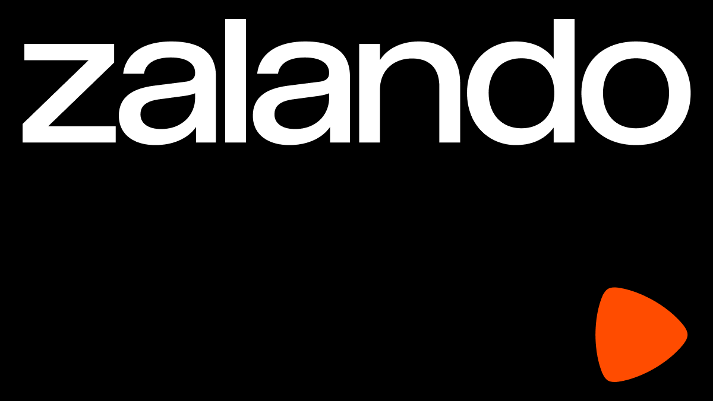
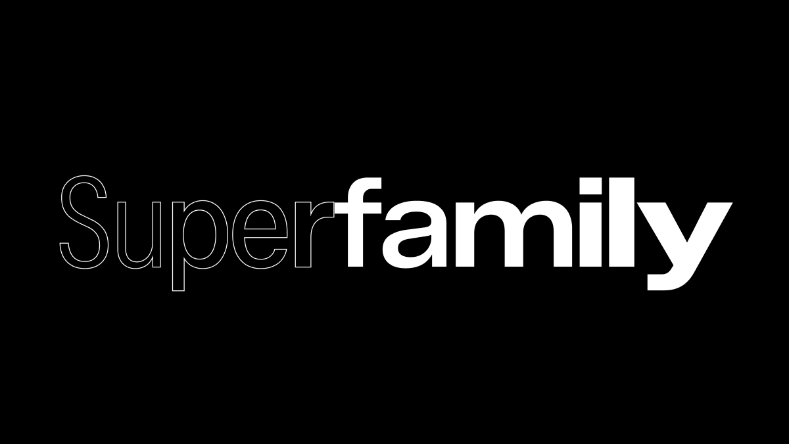
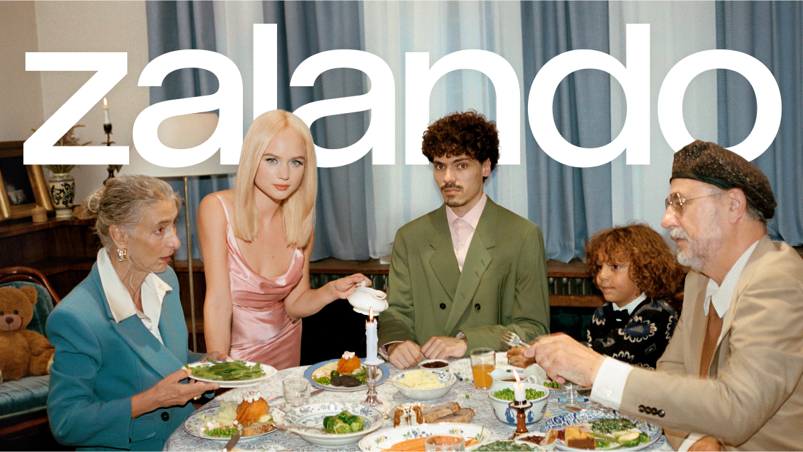

# Zalando Sans

[![][Fontbakery]](https://zalando.github.io/sans.git/fontbakery/fontbakery-report.html)
[![][Universal]](https://zalando.github.io/sans.git/fontbakery/fontbakery-report.html)
[![][GF Profile]](https://zalando.github.io/sans.git/fontbakery/fontbakery-report.html)
[![][Shaping]](https://zalando.github.io/sans.git/fontbakery/fontbakery-report.html)

[Fontbakery]: https://img.shields.io/endpoint?url=https%3A%2F%2Fraw.githubusercontent.com%2Fzalando%2Fsans.git%2Fgh-pages%2Fbadges%2Foverall.json
[GF Profile]: https://img.shields.io/endpoint?url=https%3A%2F%2Fraw.githubusercontent.com%2Fzalando%2Fsans.git%2Fgh-pages%2Fbadges%2FGoogleFonts.json
[Outline Correctness]: https://img.shields.io/endpoint?url=https%3A%2F%2Fraw.githubusercontent.com%2Fzalando%2Fsans.git%2Fgh-pages%2Fbadges%2FOutlineCorrectnessChecks.json
[Shaping]: https://img.shields.io/endpoint?url=https%3A%2F%2Fraw.githubusercontent.com%2Fzalando%2Fsans.git%2Fgh-pages%2Fbadges%2FShapingChecks.json
[Universal]: https://img.shields.io/endpoint?url=https%3A%2F%2Fraw.githubusercontent.com%2Fzalando%2Fsans.git%2Fgh-pages%2Fbadges%2FUniversal.json

Zalando’s journey has been remarkable—transforming from a start-up into one of Europe’s leading online fashion platforms. As the market continues to evolve at pace, Zalando recognizes the need to evolve its business and brand to accelerate growth and stay at the forefront of the fashion and lifestyle landscape.

### Visual Identity

  

Zalando has elevated its core design elements to craft a flexible yet cohesive identity, marking its evolution into an inspiring destination for fashion, lifestyle, and entertainment. At the center of this transformation is the **Zalando Sans typeface family**.

**Zalando Sans** is a dynamic and versatile variable sans-serif typeface, designed to adapt effortlessly across tones, styles, and formats.

With weight, width, and slant axes, the typeface embodies Zalando’s key design principles:

- **Simple**: A system that is intuitive and easy to use, ensuring a consistent experience.  
- **Dynamic**: Enhanced brand assets that drive recognition and pride.  
- **Consistent**: A clarified brand role that fosters strong associations.  
- **Flexible**: Future-ready design, built to scale with new propositions, experiences, and channels.

### Brand Positioning

Zalando positions itself as the go-to destination for quality fashion, lifestyle shopping, and personalized inspiration. Its visual identity is an expression of the brand promise: helping people feel confident in their style.

Zalando’s brand identity embraces boldness, not just in visual expression but in its commitment to helping people feel confident and have fun with their personal style. Boldness means taking creative risks, celebrating individuality, and championing a culture of fearlessness,

By turning up the fun and being welcoming in everything they do, Zalando creates moments that people can look forward to — curating a dynamic world of inspiration in motion.

At the heart of it all, Zalando tells stories that champion personal style and inspire confidence.

This is A New Style of Entertainment.

## Building the font

Fonts are built automatically by GitHub Actions - take a look in the "Actions" tab for the latest build.

If you want to build fonts manually on your own computer:

* `make build` will produce font files.
* `make test` will run [FontBakery](https://github.com/googlefonts/fontbakery)'s quality assurance tests.
* `make proof` will generate HTML proof files.

The proof files and QA tests are also available automatically via GitHub Actions - look at https://zalando.github.io/sans.git.

Google Fonts uses Github Releases to manage font families. If you feel your font project has hit a milestone, you must create a new release for it. In order to do this, go to the releases page and hit the "Draft a new release button". You must provide a tag number and title which can only be a decimal number e.g 0.100, 1.000 etc. For the body text, mention what has changed since the last release. Once you are done, hit the "Publish release" button. Here is an example which fulfills the requirements, https://github.com/m4rc1e/test-ufr-family/releases/tag/2.019. For more info regarding Github release, please see the official Github Release [documentation](https://docs.github.com/en/repositories/releasing-projects-on-github/managing-releases-in-a-repository). **Please note that Github Actions must be able to build the fonts before you can make a release. Once you have made a release, the fonts and tests assets will be attached to the release automatically. This may take a while since the fonts and tests will be built from scratch so please be patient.**

## License

This Font Software is licensed under the SIL Open Font License, Version 1.1.
This license is available with a FAQ at https://openfontlicense.org

## Repository Layout

This font repository structure is inspired by [Unified Font Repository v0.3](https://github.com/unified-font-repository/Unified-Font-Repository), modified for the Google Fonts workflow.
