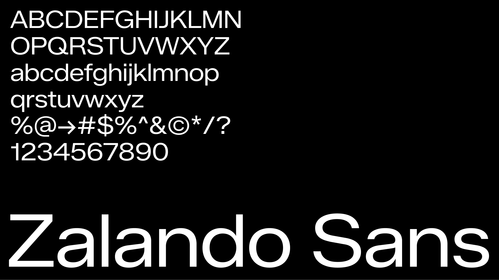
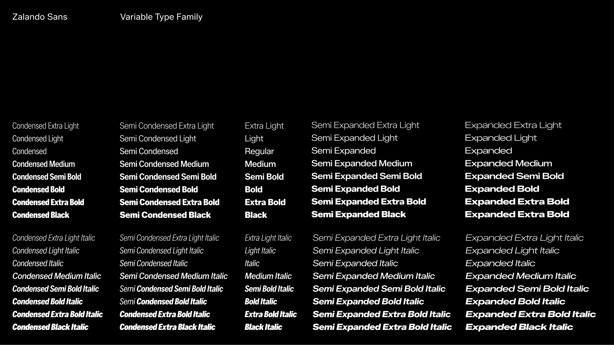
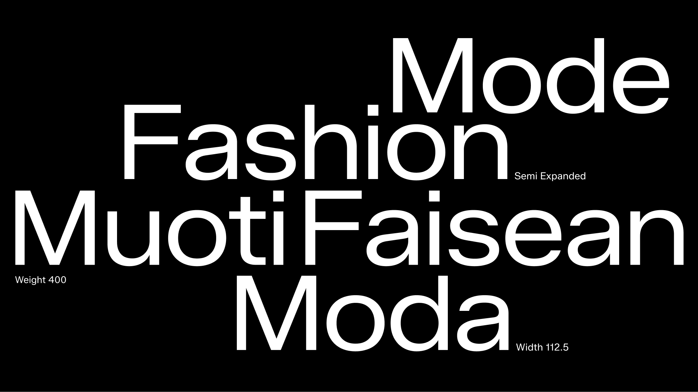

# Zalando Sans

Zalando Sans is a bespoke sans serif typeface, developed as a cornerstone of the Zalando brand identity. Designed with flexibility and accessibility at the heart, it meets the diverse needs of the Zalando eco-system.

  

The typeface offers exceptional adaptability through its variable font technology:
	
- A weight axis ranging from ExtraLight to Black
- A width axis ranging from Condensed to Expanded
- A slant axis ranging from upright to italic
	
This flexibility allows for a wide range of expressive possibilities while maintaining a cohesive brand presence. Rooted in a sans serif “grotesque” style, the typeface aims to balance clean simplicity with attitude, combining clarity with subtle moments of personality. Its clean lines and modern aesthetic reflect Zalando's forward-thinking approach to fashion and lifestyle.

  

Staying true to Zalando’s personality—Bold, Fun, and Welcoming—Zalando Sans elevates every design it inhabits. When used effectively, it becomes a powerful design element, showcasing Zalando’s commitment to helping people feel confident in their style.

  

Zalando Sans was designed by Jakob Ekelund of KH Type, Stockholm in 2025 in collaboration with the Zalando brand and product design teams in Berlin.

## Building the font

Fonts are built automatically by GitHub Actions - take a look in the "Actions" tab for the latest build.

If you want to build fonts manually on your own computer:

* `make build` will produce font files.
* `make test` will run [FontBakery](https://github.com/googlefonts/fontbakery)'s quality assurance tests.
* `make proof` will generate HTML proof files.

The proof files and QA tests are also available automatically via GitHub Actions - look at https://zalando.github.io/sans.git.

Google Fonts uses Github Releases to manage font families. If you feel your font project has hit a milestone, you must create a new release for it. In order to do this, go to the releases page and hit the "Draft a new release button". You must provide a tag number and title which can only be a decimal number e.g 0.100, 1.000 etc. For the body text, mention what has changed since the last release. Once you are done, hit the "Publish release" button. Here is an example which fulfills the requirements, https://github.com/m4rc1e/test-ufr-family/releases/tag/2.019. For more info regarding Github release, please see the official Github Release [documentation](https://docs.github.com/en/repositories/releasing-projects-on-github/managing-releases-in-a-repository). **Please note that Github Actions must be able to build the fonts before you can make a release. Once you have made a release, the fonts and tests assets will be attached to the release automatically. This may take a while since the fonts and tests will be built from scratch so please be patient.**

## License

This Font Software is licensed under the SIL Open Font License, Version 1.1.
This license is available with a FAQ at https://openfontlicense.org

## Repository Layout

This font repository structure is inspired by [Unified Font Repository v0.3](https://github.com/unified-font-repository/Unified-Font-Repository), modified for the Google Fonts workflow.
